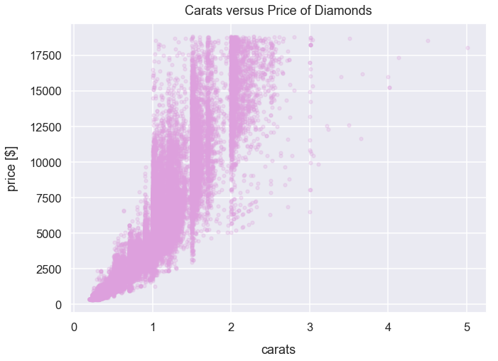
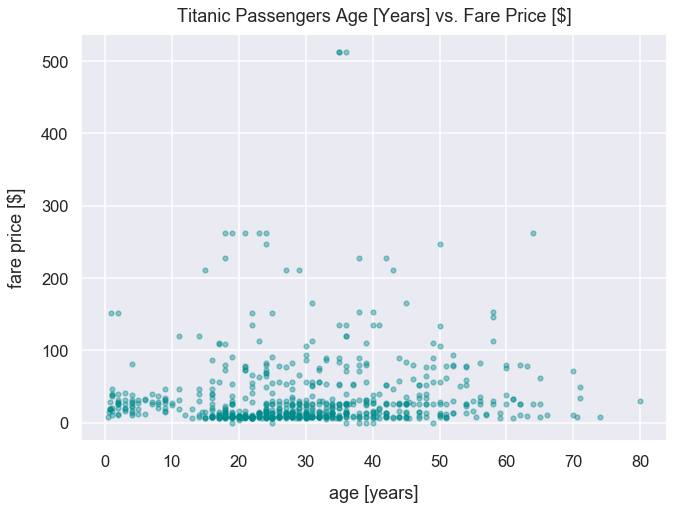

Title: Correlation
Slug: correlation
Summary: Understand what is correlation in statistics and how to interpet this statistic
Date: 2018-12-5 10:20  
Category: Math
Subcategory: Descriptive Statistics
PostType: Article
Keywords: correlation pandas python
Tags: correlation, scatter, python, pandas
Authors: Dan Friedman

In statistics, the **Pearson correlation coefficient** is a measure of linear correlation between two variables of data. 

In business context, the term *correlation* is used to to describe a relationship between two or more things. This is an alternative use case than what we'll cover in this article which is just the pearson correlation coefficient.

This tutorial will illustrate the pearson correlation through scatter plots and analysis of the exact correlation coefficient values.

### Explanation of Coefficient Values

If the correlation coefficient is *positive*, as values from one variable increase, so does the other. 

If the correlation coefficient is *negative*, as values from one variable decrease, the values from other variable increase. 

The table below provides some examples of Pearson's correlation coefficient values and explanations.

Pearson's correlation coefficient | Interpretation
--- | ---
0 | There's *no* correlation between the two variables
-0.25 | There's a small *negative* correlation between the two variables
-0.75 | There's a large *negative* correlation between the two variables
-1.0 | There's a perfect *negative* correlation between the two variables 
0.25 | There's a small *positive* correlation between the two variables
0.75 | There's a large *positive* correlation between the two variables
1.0 | There's a perfect *positive* correlation between the two variables 

### Assumption to Prove Correlation

Generally, for both variables compared, we want them to be roughly normally distributed. The reason for this is that it's unfair to interpret a correlation pattern if we're just looking at extremes of values. 

For example, let's say we want to understand the relationship between income and net worth. We'd initially *assume* there's a positive linear relationship between the two variables: as income increases, net worth increases. However, hypothetically, let's say our dataset just had net income values around 0-20,00 U.S. dollars and 150,000-500,000 U.S. dollars. In this instance, our income values wouldn't represent a normal distribution. We're missing lots of income values between 20,000 and 150,000 U.S. dollars - which I think is a fairly common range for U.S. workers. 

We could still compare income and net worth and we'd likely see the people in that small income range have low net worth values while the people in that much higher net income range have larger net worth values. Yet, it's unfair to interpret correlation between these two variables since we're neglecting a huge portion of people with a certain income and it's biased to connect a relationship between *just* the extremes of income data.

Let's move onto some visual examples now to explain correlation.

### Import Modules


```python
import pandas as pd
import seaborn as sns
import scipy.stats as stats
import matplotlib.pyplot as plt
% matplotlib inline
```

Visualization styling code


```python
sns.set(rc={'figure.figsize':(10.5, 7.5)})
sns.set_context('talk')
```

### Example 1: Tips Dataset - Total Bill and Tip

#### Get the Data

Let's get the `tips` dataset from the `seaborn` library and assign it to the DataFrame `df_tips`.


```python
df_tips = sns.load_dataset('tips')
```

Each row represents a unique meal at a restaurant for a party of people; the dataset contains the following fields:

column name | column description 
--- | ---
`total_bill` | financial amount of meal in U.S. dollars
`tip` |  financial amount of the meal's tip in U.S. dollars
`sex` | gender of server
`smoker` | boolean to represent if server smokes or not
`day` | day of week
`time` | meal name (Lunch or Dinner)
`size` | count of people eating meal

Preview the first 5 rows of `df_tips`. 


```python
df_tips.head()
```


<div>
<style scoped>
    .dataframe tbody tr th:only-of-type {
        vertical-align: middle;
    }

    .dataframe tbody tr th {
        vertical-align: top;
    }

    .dataframe thead th {
        text-align: right;
    }
</style>
<table border="1" class="dataframe">
  <thead>
    <tr style="text-align: right;">
      <th></th>
      <th>total_bill</th>
      <th>tip</th>
      <th>sex</th>
      <th>smoker</th>
      <th>day</th>
      <th>time</th>
      <th>size</th>
    </tr>
  </thead>
  <tbody>
    <tr>
      <th>0</th>
      <td>16.99</td>
      <td>1.01</td>
      <td>Female</td>
      <td>No</td>
      <td>Sun</td>
      <td>Dinner</td>
      <td>2</td>
    </tr>
    <tr>
      <th>1</th>
      <td>10.34</td>
      <td>1.66</td>
      <td>Male</td>
      <td>No</td>
      <td>Sun</td>
      <td>Dinner</td>
      <td>3</td>
    </tr>
    <tr>
      <th>2</th>
      <td>21.01</td>
      <td>3.50</td>
      <td>Male</td>
      <td>No</td>
      <td>Sun</td>
      <td>Dinner</td>
      <td>3</td>
    </tr>
    <tr>
      <th>3</th>
      <td>23.68</td>
      <td>3.31</td>
      <td>Male</td>
      <td>No</td>
      <td>Sun</td>
      <td>Dinner</td>
      <td>2</td>
    </tr>
    <tr>
      <th>4</th>
      <td>24.59</td>
      <td>3.61</td>
      <td>Female</td>
      <td>No</td>
      <td>Sun</td>
      <td>Dinner</td>
      <td>4</td>
    </tr>
  </tbody>
</table>
</div>


#### Plot the Relationship Between Total Bill and Tip Amounts

The plot below has total bill values on the x-axis and tips on the y-axis. 


```python
df_tips.plot.scatter(x='total_bill', y='tip', s=28, alpha=0.6, c='darkgreen')
plt.xlabel("total bill [$]", labelpad=15)
plt.ylabel("tip [$]", labelpad=15)
plt.title("Total Bill vs. Tips", y=1.015);
```


There seems to be a large positive correlation between the two variables. As total bill sizes increase, tip values increase too. This is what we'd expect since tips given at restaurants are typically 20% of total bill size, so there's mutual dependence between these two variables.

#### Evaluate the Pearson's Correlation Coefficient Between Tips and Bill Amounts

We can use the `scipy` packages's `stats` module and <a href='https://docs.scipy.org/doc/scipy-0.14.0/reference/generated/scipy.stats.pearsonr.html'>`pearsonr()` method</a> to compute the Pearson correlation coefficient.

This method returns a list in which the first value is the correlation coefficient. 

Our returned value is 0.68 which confirms our belief that there's a large positive correlation between the two variables.


```python
round(stats.pearsonr(df_tips['tip'], df_tips['total_bill'])[0], 2)
```


    0.68


We can also the use DataFrame method <a href='https://pandas.pydata.org/pandas-docs/stable/generated/pandas.DataFrame.corr.html'>`corr()`</a> from the pandas package to  compute a pairwise correlation of columns. 

There'll always be a perfect positive correlation, a coefficient of 1, for each variable with itself. The 0.68 value below is the same as the one from our calculation with scipy above.


```python
df_tips[['tip', 'total_bill']].corr()
```


<div>
<style scoped>
    .dataframe tbody tr th:only-of-type {
        vertical-align: middle;
    }

    .dataframe tbody tr th {
        vertical-align: top;
    }

    .dataframe thead th {
        text-align: right;
    }
</style>
<table border="1" class="dataframe">
  <thead>
    <tr style="text-align: right;">
      <th></th>
      <th>tip</th>
      <th>total_bill</th>
    </tr>
  </thead>
  <tbody>
    <tr>
      <th>tip</th>
      <td>1.000000</td>
      <td>0.675734</td>
    </tr>
    <tr>
      <th>total_bill</th>
      <td>0.675734</td>
      <td>1.000000</td>
    </tr>
  </tbody>
</table>
</div>


### Example 2: Diamonds Dataset - Carat and Price

#### Get Diamonds Dataset

Import `diamonds` dataset from Seaborn library and assign to DataFrame `df_diamonds`.

Each row of `df_diamonds` contains details about a specific diamond purchased. We'll just utilize the `price` and `carat` columns below.


```python
df_diamonds = sns.load_dataset('diamonds')
```

Preview the first few rows of `df_diamonds`.


```python
df_diamonds.head()
```


<div>
<style scoped>
    .dataframe tbody tr th:only-of-type {
        vertical-align: middle;
    }

    .dataframe tbody tr th {
        vertical-align: top;
    }

    .dataframe thead th {
        text-align: right;
    }
</style>
<table border="1" class="dataframe">
  <thead>
    <tr style="text-align: right;">
      <th></th>
      <th>carat</th>
      <th>cut</th>
      <th>color</th>
      <th>clarity</th>
      <th>depth</th>
      <th>table</th>
      <th>price</th>
      <th>x</th>
      <th>y</th>
      <th>z</th>
    </tr>
  </thead>
  <tbody>
    <tr>
      <th>0</th>
      <td>0.23</td>
      <td>Ideal</td>
      <td>E</td>
      <td>SI2</td>
      <td>61.5</td>
      <td>55.0</td>
      <td>326</td>
      <td>3.95</td>
      <td>3.98</td>
      <td>2.43</td>
    </tr>
    <tr>
      <th>1</th>
      <td>0.21</td>
      <td>Premium</td>
      <td>E</td>
      <td>SI1</td>
      <td>59.8</td>
      <td>61.0</td>
      <td>326</td>
      <td>3.89</td>
      <td>3.84</td>
      <td>2.31</td>
    </tr>
    <tr>
      <th>2</th>
      <td>0.23</td>
      <td>Good</td>
      <td>E</td>
      <td>VS1</td>
      <td>56.9</td>
      <td>65.0</td>
      <td>327</td>
      <td>4.05</td>
      <td>4.07</td>
      <td>2.31</td>
    </tr>
    <tr>
      <th>3</th>
      <td>0.29</td>
      <td>Premium</td>
      <td>I</td>
      <td>VS2</td>
      <td>62.4</td>
      <td>58.0</td>
      <td>334</td>
      <td>4.20</td>
      <td>4.23</td>
      <td>2.63</td>
    </tr>
    <tr>
      <th>4</th>
      <td>0.31</td>
      <td>Good</td>
      <td>J</td>
      <td>SI2</td>
      <td>63.3</td>
      <td>58.0</td>
      <td>335</td>
      <td>4.34</td>
      <td>4.35</td>
      <td>2.75</td>
    </tr>
  </tbody>
</table>
</div>


#### Explanation of carats

`carat` is a unit of measurement in diamonds to characterize its mass. Typically, bigger/heavier diamonds are known to be more expensive.

Here's a helpful image from <a href='https://www.womangettingmarried.com/guide-diamond-carats-prices/'>womengettingmaried.com</a>.


#### View Distribution of Carats versus Diamond Prices

The plot below has carats on the x-axis and price on the y-axis. 


```python
df_diamonds.plot.scatter(x='carat', y='price', s=22, alpha=0.25, c='plum')
plt.xlabel("carats", labelpad=15)
plt.ylabel("price [$]", labelpad=15)
plt.title("Carats versus Price of Diamonds", y=1.015);
```





There seems to be a large positive correlation between the two variables. As carats increases, price increases too. This is expected since we assume larger/heavier diamonds are priced higher than smaller ones. 

#### Evaluate the Pearson's Correlation Coefficient Between Tips and Bill Amounts


```python
round(stats.pearsonr(df_diamonds['carat'], df_diamonds['price'])[0], 2)
```


    0.92


Our returned value is 0.92 means there's a very strong (nearly perfect) correlation between the two variables.

### Example 3: Titanic Dataset - Age and Fare Price

#### Get Titanic Dataset

Import `titanic` dataset from Seaborn library and assign to DataFrame `df_titanic`.

Each row of `df_titanic` represents details of a passenger of the ship. We'll just utilize the `age` and `fare` columns below. The `fare` column represents the price a passenger paid to board the ship.


```python
df_titanic = sns.load_dataset('titanic')
```

Preview the first few rows of `df_titanic`.


```python
df_titanic.head()
```


<div>
<style scoped>
    .dataframe tbody tr th:only-of-type {
        vertical-align: middle;
    }

    .dataframe tbody tr th {
        vertical-align: top;
    }

    .dataframe thead th {
        text-align: right;
    }
</style>
<table border="1" class="dataframe">
  <thead>
    <tr style="text-align: right;">
      <th></th>
      <th>survived</th>
      <th>pclass</th>
      <th>sex</th>
      <th>age</th>
      <th>sibsp</th>
      <th>parch</th>
      <th>fare</th>
      <th>embarked</th>
      <th>class</th>
      <th>who</th>
      <th>adult_male</th>
      <th>deck</th>
      <th>embark_town</th>
      <th>alive</th>
      <th>alone</th>
    </tr>
  </thead>
  <tbody>
    <tr>
      <th>0</th>
      <td>0</td>
      <td>3</td>
      <td>male</td>
      <td>22.0</td>
      <td>1</td>
      <td>0</td>
      <td>7.2500</td>
      <td>S</td>
      <td>Third</td>
      <td>man</td>
      <td>True</td>
      <td>NaN</td>
      <td>Southampton</td>
      <td>no</td>
      <td>False</td>
    </tr>
    <tr>
      <th>1</th>
      <td>1</td>
      <td>1</td>
      <td>female</td>
      <td>38.0</td>
      <td>1</td>
      <td>0</td>
      <td>71.2833</td>
      <td>C</td>
      <td>First</td>
      <td>woman</td>
      <td>False</td>
      <td>C</td>
      <td>Cherbourg</td>
      <td>yes</td>
      <td>False</td>
    </tr>
    <tr>
      <th>2</th>
      <td>1</td>
      <td>3</td>
      <td>female</td>
      <td>26.0</td>
      <td>0</td>
      <td>0</td>
      <td>7.9250</td>
      <td>S</td>
      <td>Third</td>
      <td>woman</td>
      <td>False</td>
      <td>NaN</td>
      <td>Southampton</td>
      <td>yes</td>
      <td>True</td>
    </tr>
    <tr>
      <th>3</th>
      <td>1</td>
      <td>1</td>
      <td>female</td>
      <td>35.0</td>
      <td>1</td>
      <td>0</td>
      <td>53.1000</td>
      <td>S</td>
      <td>First</td>
      <td>woman</td>
      <td>False</td>
      <td>C</td>
      <td>Southampton</td>
      <td>yes</td>
      <td>False</td>
    </tr>
    <tr>
      <th>4</th>
      <td>0</td>
      <td>3</td>
      <td>male</td>
      <td>35.0</td>
      <td>0</td>
      <td>0</td>
      <td>8.0500</td>
      <td>S</td>
      <td>Third</td>
      <td>man</td>
      <td>True</td>
      <td>NaN</td>
      <td>Southampton</td>
      <td>no</td>
      <td>True</td>
    </tr>
  </tbody>
</table>
</div>


Let's create a new DataFrame assigned to the variable `df_titanic_non_nulls` that filters out the rows in the `age` column that were nulls.


```python
df_titanic_non_nulls = df_titanic[df_titanic['age'].notnull()==True]
```

#### View Distribution of Age vs. Fare Prices

The plot below has age in years on the x-axis and price in U.S. dollars on the y-axis.


```python
df_titanic_non_nulls.plot.scatter(x='age', y='fare', s=22, alpha=0.4, c='darkcyan')
plt.xlabel("age [years]", labelpad=15)
plt.ylabel("fare price [$]", labelpad=15)
plt.title("Titanic Passengers Age [Years] vs. Fare Price [$]", y=1.015);
```





There seems to be no clear correlation between the two variables. The visualization just illustrates just a bunch of random dots.

#### Evaluate the Pearson's Correlation Coefficient Between Age and Fare Price


```python
round(stats.pearsonr(df_titanic_non_nulls['age'], df_titanic_non_nulls['fare'])[0], 1)
```


    0.1


Our returned value is 0.1 means there's essentially no correlation between the two variables. A change in the value of one variable has no expected change in the value of the other variable.

### Correlation Does Not Imply Causation

One of the most popular terms in the field of statistics is "correlation does not imply causation". A correlation means there's a linear relationship between two variables. A causation connects one process, the *cause*, with another process or state, the *effect*. 

However, this does not mean a change in one variable *causes* a change in the value of the other variable. 

For example, there are studies that have likely proved that increased exercise correlates with a decrease in a person's mass. This is considered to be a strong *negative* correlation between the two variables. This relationship has also likely been proven to be cause-and-effect in which once the activity of exercising takes place, this *causes* the decrease in a person's mass. 

On the other hand, here's a different example mentioned in this <a href='https://en.wikipedia.org/wiki/Correlation_does_not_imply_causation'>Wikediia article</a>: as ice cream sales increase, the rate of drowning deaths increases sharply. These two variables can be correlated. So as ice cream sales have increased over time, so have drowning deaths so there's a positive linear relationship between the two variables. Yet, it's incredibly unlikely there there's *any causuality relationship* between those two variables since they're so distinct from one another. Rather, people eat more ice cream in warm-weather months and also likely swim more in these months. If more people are swimming, there's likely a greater chance of drowning deaths. The fact is: ice cream consumption *does not cause* drowning. There's lots of other factors to consider in this relationship such as weather.
